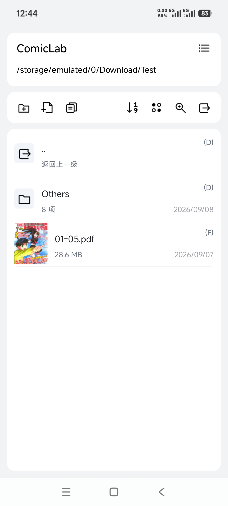
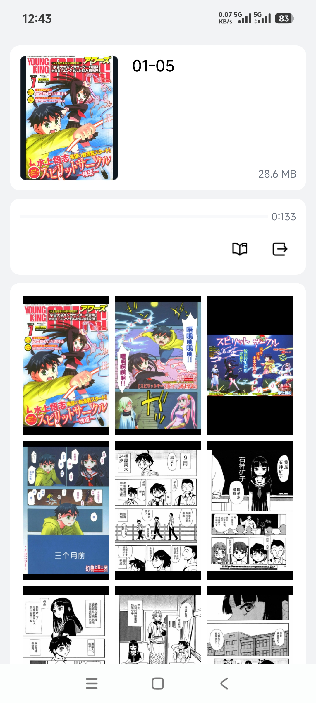
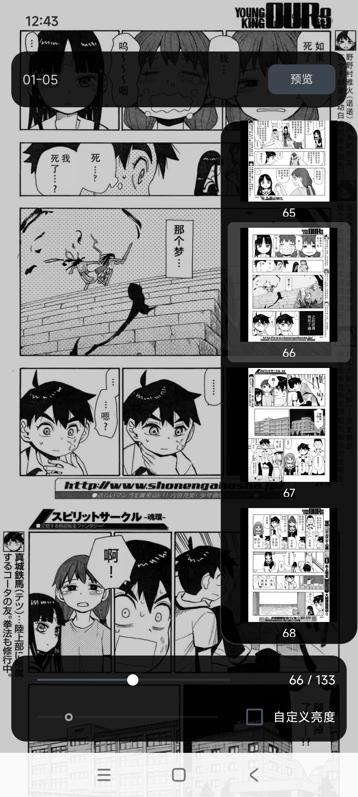

[简体中文](README.md) | [English](README.en.md)

# ComicLab

ComicLab is a local comics and ebook reader for Android. It lets you browse comics and ebooks stored on your device and read ZIP, CBZ, RAR, CBR, 7Z, CB7, PDF, DRM-free MOBI, and DRM-free EPUB files.

The project focuses on local file browsing, comic cover previews, page previews, high-resolution reading, and reading progress management.

After the comic reader I used started showing more ads and stopped updating some features I relied on, I decided to build my own. It meets my needs and has **no ads**.

**If you use ComicLab and have feature requests or run into any issues, please send your feedback to the author.**

Download:

[Download the latest release](https://github.com/Cillebokin/ComicLab/releases)

## Features

- Browse local files on your device, including comics, images, and ebooks
- View comic covers, file details, and page thumbnails
- Read high-resolution pages, zoom, turn pages, and resume from your previous reading position
- Read PDFs with progressive loading, tiled rendering, and memory safeguards
- No ads; data is stored locally

## Screenshots

### Local file browser



### Comic details and page previews



### Reader and preview panel



## Supported formats

| Type | Formats |
| --- | --- |
| Comics | PDF |
| Comic archives | ZIP, CBZ, RAR, CBR, 7Z, CB7 |
| Ebooks | MOBI (DRM-free), EPUB (DRM-free) |
| Images | JPG, JPEG, PNG, WEBP, GIF, BMP |

## Requirements

- Android 13 or later
- The **All files access** permission must be granted

## Release notes

For detailed changes, see `版本说明.txt`.

## Author

Cillebokin / swcillebokin@gmail.com

Project:

```text
https://github.com/Cillebokin/ComicLab
```
